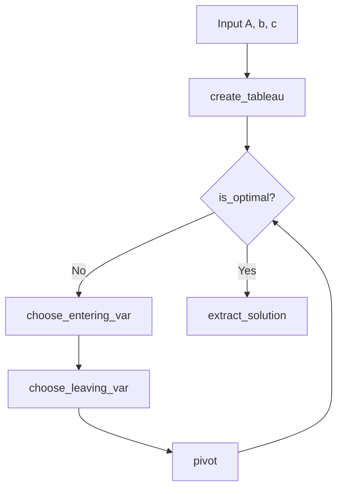

# Simplex Solver for Linear Programming

## Overview

This project implements the Simplex method in Python to solve a sample linear programming problem. It builds a tableau from NumPy arrays, pivots between basic solutions, and returns the objective value and variable values. The implementation is a small, first-principles demonstration rather than a general-purpose optimization library.



## Mathematical background

The solver addresses a maximization problem in standard form: maximize `cᵀx` subject to `Ax ≤ b` and `x ≥ 0`. The Simplex method uses a tableau to represent the constraints and objective, then pivots to update the current basic solution until the objective row meets the implementation's optimality check. Slack variables turn the `≤` constraints into equalities.

## Features

- Builds a tableau and adds slack-variable columns.
- Chooses entering and leaving variables and performs row pivots.
- Returns the objective value, decision variables, and slack variables as a NumPy array.

## How the implementation works

The solver is implemented in `simplex.py`. `create_tableau` assembles the objective row, constraints, slack columns, and right-hand sides. `choose_entering_var` selects the largest positive objective-row coefficient; `choose_leaving_var` selects the row with the smallest RHS-to-pivot-column ratio. `pivot` normalizes the selected row and eliminates the entering variable from the other rows. `is_optimal` checks for positive coefficients in the objective row, and `extract_solution` reads values from unit-vector columns in the final tableau. `Simplex(A, b, c)` coordinates these functions and returns the resulting vector.

## Project structure

- `simplex.py` — tableau construction, pivoting, solution extraction, and the runnable sample problem.
- `excel_sol_validation.xlsx` — workbook containing the sample decision variables, objective calculation, and constraint checks.

## Installation

Clone the repository, create a local virtual environment, and install NumPy:

```bash
git clone https://github.com/qusaigazz/Simplex-Solver-LP.git
cd Simplex-Solver-LP
python -m venv .venv
```

Activate the environment (`source .venv/bin/activate` on macOS/Linux or `.\.venv\Scripts\Activate.ps1` in Windows PowerShell), then run:

```bash
python -m pip install numpy
```

The `.venv` directory is a local environment and should normally be excluded from version control in `.gitignore`.

## Usage

Run the sample problem included at the bottom of `simplex.py`:

```bash
python simplex.py
```

The script prints:

```text
[2085.714   11.429   25.714   17.143    0.       0.       0.   ]
```

The returned array is `[z, x1, x2, x3, s1, s2, s3]`: the objective value is approximately `2085.714`, the decision variables are approximately `(11.429, 25.714, 17.143)`, and the slack variables are zero for this sample.

## Validation

The sample solver result is checked against `excel_sol_validation.xlsx`, which independently calculates the sample LP's objective value and checks its constraints.

## Limitations

- The example is hard-coded; there is no command-line interface or LP input parser.
- The implementation assumes a maximization problem with `Ax ≤ b`, nonnegative variables, and compatible NumPy array shapes.
- It does not explicitly handle infeasible or unbounded problems, degeneracy, or invalid input.

## Future improvements

- Validate input dimensions and handle zero or invalid pivot ratios explicitly.
- Add support for other constraint types and minimization problems.
- Separate the sample runner from the solver and provide a user-facing input interface.

## Motivation

This project was developed to understand linear programming and the Simplex algorithm from first principles.
